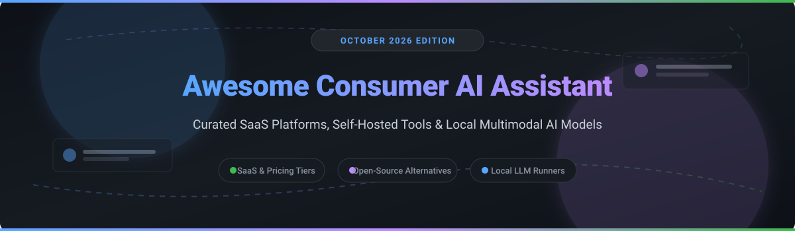

  

# 🤖 Awesome Consumer AI Assistant

  
  
  
  
  

> 🌟 **A Curated List of Consumer AI Assistant SaaS Products, Self-Hosted Solutions & Local LLM Projects.**

*Focused on General-Purpose Chat Assistants, Multimodal AI, Voice AI, Private Search & Self-Hosted Alternatives.*

📅 **Last updated: October 2026**

---

## 💡 Overview

This repository tracks notable **SaaS platforms** and **open-source projects** for **Consumer AI Assistants**. These tools empower individuals with everyday tasks — answering complex questions, drafting content, coding, research, and creative generation — through modern conversational and multimodal AI.

* **SaaS Leaders**: Microsoft Copilot, OpenAI ChatGPT, Google Gemini, Anthropic Claude, Perplexity AI, Meta AI, You.com, Character.ai, Pi AI, and Replika.
* **Open-Source & Self-Hosted Solutions**: Open WebUI, AnythingLLM, Vane (Perplexica), Morphic, Scira, Page Assist, Continue.dev, Jan, LibreChat, Lobe Chat, PocketPal AI, Llama.cpp, and Ollama.

---

## 📖 Table of Contents

- [☁️ SaaS / Hosted Platforms](#%EF%B8%8F-saas--hosted-platforms)
- [🔓 Open-Source GitHub Projects](#-open-source-github-projects)
- [🤝 How to Contribute](#-how-to-contribute)
- [💖 Support](#-support)
- [⚠️ Disclaimer](#%EF%B8%8F-disclaimer)
- [⭐ Star History](#-star-history)

---

## ☁️ SaaS / Hosted Platforms

> 📊 **Market Context**: The global consumer AI assistant market is estimated at **~$15B in 2026**, growing toward **~$60B by 2032** at a **~26% CAGR**. The sector is **moderately concentrated** at the premium tier — **ChatGPT** leads with **800M weekly active users**, while **Google Gemini** surpassed **450M monthly active users**. **Claude** leads in complex reasoning & coding, while **Perplexity** dominates source-backed web search. **Pricing tiers have stratified**: free tiers offer basic or rate-limited chat, standard plans cluster at **$20/month**, and power-user tiers reach **$200–$300/month**. **Microsoft Copilot** is integrated across Windows and M365 ecosystems ($30/user/month for enterprise/M365). No single vendor holds a winner-take-all monopoly; consumers frequently utilize multi-assistant workflows.

| Platform | Description | Starting Paid Tier Pricing | Free Tier Limits | Company Size / Valuation |
|:---|:---|:---|:---|:---|
| **[Google Gemini](https://gemini.google.com/)** 🟢 | **Google's flagship multimodal AI assistant.** Deeply integrated into Workspace, Google Search, and Android OS. | **Google AI Pro**: $20/month ($240/yr) | **Free Plan**: Access to Gemini 3.6 Flash model with rate limits & standard context window | **~$350B Revenue** (Alphabet FY2025) |
| **[Microsoft Copilot](https://copilot.microsoft.com/)** 💻 | **Microsoft's consumer & enterprise AI assistant.** Deeply integrated into Windows 11, Edge browser, and M365 suite. | **M365 Copilot**: $30/user/month | **Free Plan**: Web chat access with daily turn limits & standard model speed | **~$281B Revenue** (Microsoft FY2025) |
| **[Meta AI](https://www.meta.ai/)** 💬 | **Meta's free consumer AI assistant.** Integrated natively into WhatsApp, Instagram, Messenger, and Ray-Ban Smart Glasses. | **Free** (No paid tier available) | **Free Plan**: 100% free with soft rate limits during peak network congestion | **~$165B Revenue** (Meta FY2025) |
| **[OpenAI ChatGPT](https://chatgpt.com/)** 🤖 | **The category-defining conversational AI.** Powered by GPT-5.6 with multimodal capabilities, web search, voice, and deep research. | **ChatGPT Plus**: $20/month | **Free Plan**: Unlimited basic text chat with GPT-5.6 Luna; strict daily limits on file uploads, image generation, and deep research | **~$300B Valuation** (~$20B Annual Revenue 2025 est.) |
| **[Anthropic Claude](https://claude.ai/)** 🧠 | **Reasoning & coding-focused AI assistant.** Renowned for frontier coding capabilities, nuanced writing, and safety alignment. | **Claude Pro**: $20/month | **Free Plan**: Session-based message limits resetting every 5 hours (limits scale dynamically with server demand) | **~$60B Valuation** (~$1B+ ARR 2025 est.) |
| **[Perplexity AI](https://www.perplexity.ai/)** 🔍 | **Source-backed conversational AI search engine.** Delivers real-time web search results complete with inline citations. | **Perplexity Pro**: $20/month | **Free Plan**: Unlimited quick searches; 5 Pro (deep research) searches per 4 hours | **~$9B Valuation** (~$100M ARR 2025 est.) |
| **[Character.ai](https://character.ai/)** 🎭 | **Interactive AI character & roleplay platform.** Millions of user-created AI personalities and conversational avatars. | **c.ai+**: $9.99/month | **Free Plan**: Unlimited character chats; standard queue priority during high traffic | **~$5B Valuation** (2024 est.) |
| **[You.com](https://you.com/)** 🌐 | **AI search engine & multi-model assistant.** Offers customizable AI modes for academic research, coding, and writing. | **You Pro**: $20/month | **Free Plan**: 5 Pro queries per day; basic search queries unlimited | **Private** (~$100M+ raised to date) |
| **[Replika](https://replika.com/)** 🤖 | **AI companion engineered for emotional support.** Personal AI friend designed for daily voice calls, text conversations, and empathy. | **Replika Pro**: $19.99/month (or $69.99/yr) | **Free Plan**: Basic text conversation; advanced relationship modes & voice calls locked | **Private** (~$50M+ raised to date) |
| **[Pi AI](https://pi.ai/)** 🕊️ | **Empathetic conversational AI by Inflection AI.** Highly conversational, supportive, and personable voice interface. | **Free** (No paid tier available) | **Free Plan**: 100% free with no message or turn restrictions | **Private** (Inflection AI) |

---

## 🔓 Open-Source GitHub Projects

Below is a curated list of production-grade, self-hosted, and local consumer AI tools sorted by GitHub Stars_Count in descending order.

| Repo | Description | GitHub_Stars |
|:---|:---|:---:|
| **[Llama.cpp](https://github.com/ggerganov/llama.cpp)** ⚡ | **Fastest & lightest LLM inference engine in C/C++.** Enables high-performance local AI inference on minimal consumer hardware with GGUF quantization. |  |
| **[Ollama](https://github.com/ollama/ollama)** 🦙 | **Simplest way to get up and running with local LLMs.** Provides a single CLI/daemon binary, GGUF model library, and OpenAI-compatible HTTP API. |  |
| **[Open WebUI](https://github.com/open-webui/open-webui)** 💻 | **The leading self-hosted ChatGPT alternative.** Full feature parity with ChatGPT, Docker deployment, Ollama integration, RAG knowledge bases, and PWA support. |  |
| **[LibreChat](https://github.com/danny-avila/LibreChat)** 🤖 | **Enhanced open-source AI web UI.** Supports OpenAI, Anthropic, Gemini, Ollama, search plugins, multi-user auth, and customizable artifacts. |  |
| **[Lobe Chat](https://github.com/lobehub/lobe-chat)** 🎨 | **Modern, high-design open-source ChatGPT framework.** Features speech synthesis, plugin ecosystem, custom agent market, and mobile-responsive UI. |  |
| **[AnythingLLM](https://github.com/Mintplex-Labs/anything-llm)** 📁 | **All-in-one desktop & enterprise AI workspace.** Private document Q&A, isolated workspaces, built-in vector database, and inline citations. |  |
| **[Continue.dev](https://github.com/continuedev/continue)** 🧑‍💻 | **Leading open-source AI coding assistant for VS Code & JetBrains.** Connect local or cloud models directly to your IDE for code generation and refactoring. |  |
| **[Vane (formerly Perplexica)](https://github.com/ItzCrazyKns/Vane)** 🔍 | **Leading open-source Perplexity alternative.** Bundles SearXNG metasearch in Docker for private, source-backed web search with zero tracking. |  |
| **[Jan](https://github.com/janhq/jan)** 📱 | **Turn-key offline ChatGPT alternative desktop app.** 100% private, cross-platform GUI for running local GGUF models via llama.cpp backend. |  |
| **[Scira (formerly MiniPerplx)](https://github.com/zaidmukaddam/scira)** 🔎 | **Minimalist AI search engine with 17 specialized search modes.** Supports live web search, YouTube, GitHub, Reddit, and Python code execution. |  |
| **[Morphic](https://github.com/miurla/morphic)** 🌐 | **AI answer engine with generative UI.** Generates rich interactive UI components, web search summaries, and document analysis. |  |
| **[Page Assist](https://github.com/n4ze3m/page-assist)** 🌐 | **Chrome & Firefox extension for local AI sidebar.** Chat with any active webpage using local LLMs via Ollama, LM Studio, or llama.cpp. |  |
| **[PocketPal AI](https://github.com/a-ghorbani/pocketpal-ai)** 📱 | **Native iOS & Android app to run models on-device.** Downloads 1B–4B SLMs from Hugging Face and runs total offline inference with hardware acceleration. |  |

---

## 🤝 How to Contribute

Contributions are welcome! Help us keep this resource up to date:

1. Fork this repository.
2. Add your suggested entry to `README.md` following the exact table structure.
3. Ensure pricing details, free tier constraints, and company metrics are factual and cited.
4. Submit a Pull Request with a short summary of changes.

---

## 💖 Support

If you find this list valuable, please consider giving it a ⭐ **Star**, **Forking** it to spread the word, or sharing it with fellow AI enthusiasts!

You can also support the maintainer directly via GitHub Sponsors:

---

## ⚠️ Disclaimer

- This is a **community-curated** educational directory — not an endorsement of any commercial platform.
- **Privacy Notice**: Consumer AI assistants process sensitive user data; inspect privacy policies before sharing confidential credentials or personal data.
- **Hardware Requirements for Local LLMs**: Running production local models requires 16GB+ System RAM (32GB+ recommended) and dedicated GPU acceleration (Apple Silicon M-series or NVIDIA RTX GPUs).

---

## ⭐ Star History

---

  Maintained with ❤️ for the open-source & AI research community. Also check out <a href="https://github.com/ishandutta2007/Awesome-Awesome-Awesome">Awesome-Awesome-Awesome</a>.

